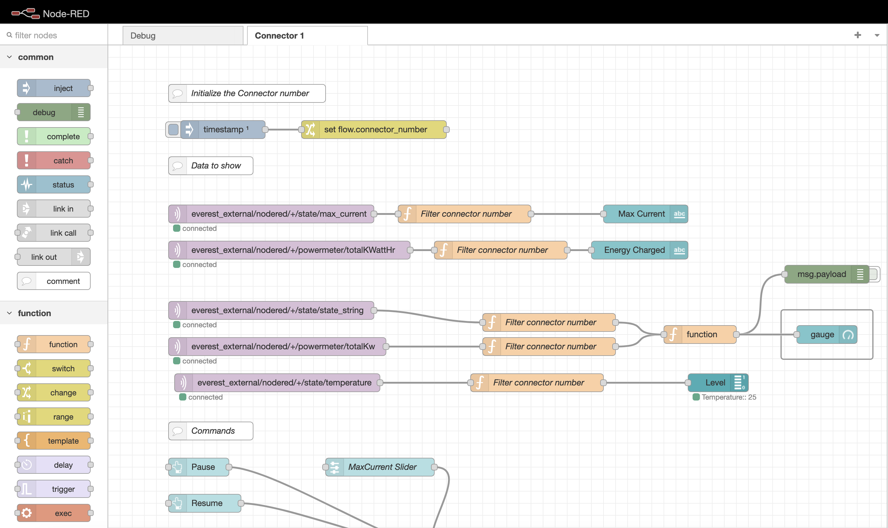
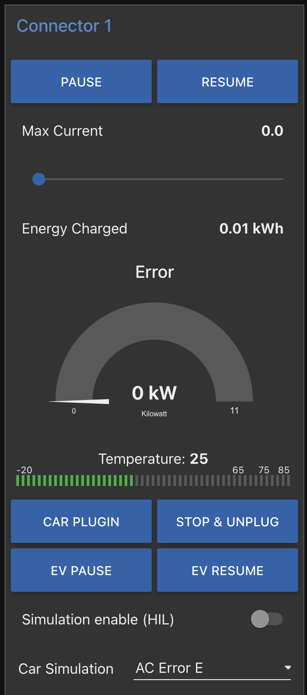

# Quick EVerest Demos

This repository is a repackaging of several simple demos of the [EVerest](https://lfenergy.org/projects/everest/) tech stack. Our intent is to showcase the foundational layers of a charging solution that could address interoperability issues in the industry, not to claim that EVerest is complete or ready for most production use cases in its current state.

## What is EVerest?
[EVerest](https://lfenergy.org/projects/everest/) is a [Linux Foundation Energy](https://lfenergy.org/) project aiming to provide a modular, open-source framework and tech stack for all manner of electric vehicle chargers. This mission and architecture mean EVerest is well positioned to serve as the base for a reference implementation of a variety of standards that can drive interoperability in the eMobility space.

### Vision
The Joint Office plans to use EVerest as a baseline from which to collaboratively build reliable interoperability solutions for EV charging. these may include the following:
    - reference implementations for standards driving interoperability between network actors including EVs, EVSEs, and CSMSs
    - interoperability testing tools and test suites
    - simulated EVs, EVSEs, etc. following interoperability best practices.

### Current Interoperability Feature Highlights
- Support for protocols/specifications:
    - EN 61851
    - ISO 15118 (AC wired charging)
        - SLAC / ISO 15118-3 in C++
        - ISO 15118-2 AC
    - DC DIN SPEC 70121
    - OCPP 1.6J including profiles and security extensions
    - Partial OCPP 2.0.1 implementation
    - Modbus
    - Sunspec

### Roadmap Items in Development
- Full OCPP 2.0.1 / 2.1
- ISO 15118-20
- Robust error handling/reporting
- Smart charging: based on solar generation and dynamic load balancing
- Remote System Architecture
- Simulated ISO 15118-20 AC vehicles
- Many ISO 15118 features

## SETUP: access docker

- If you are a developer, you might already have docker installed on your laptop. If not, [Get Docker](https://docs.docker.com/get-docker/)
    - Check that the terminal has access to `docker` and `docker compose`
 
## EV ↔ EVSE demo

This demo showcases connectivity between one to two EVs and one EVSE.
The protocol used by the EV can be selected using a UI dropdown. The dropdown can also be used to simulate errors on the EVCC.
The use cases supported by the two demos are summarized in conceptual block diagrams below.

| One EV ↔ EVSE | Two EV ↔ EVSE |
|-------|--------|
|  |  |

### STEP 1: Run the demo
- Copy and paste the command for the demo you want to see:
    - 🚨simple AC charging station ⚡: `curl -o docker-compose.yml https://raw.githubusercontent.com/US-JOET/everest-demo/main/docker-compose.yml && docker compose -p everest up`
    - 🚨 two EVSE charging ⚡: `curl -o docker-compose.yml https://raw.githubusercontent.com/US-JOET/everest-demo/main/docker-compose.two-evse.yml && docker compose -p everest-two-evse up`

### STEP 2: Interact with the demo
- Open the `nodered` flows to understand the module flows at http://127.0.0.1:1880
- Open the demo UI at http://127.0.0.1:1880/ui

| Nodered flows | Demo UI | Including simulated error |
 |-------|--------|------|
 |  |  |  |
 

### STEP 3: See the list of modules loaded and the high level message exchange

### TEARDOWN: Clean up after the demo
- Kill the demo process
- Delete files and containers: `docker compose -p everest down && rm docker-compose.yml`

## High level block diagram overview of EVerest capabilities
From https://everest.github.io/nightly/general/01_framework.html

